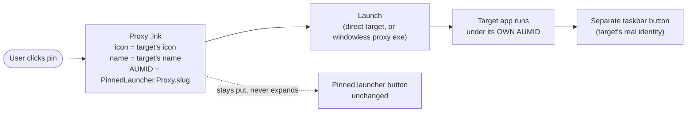
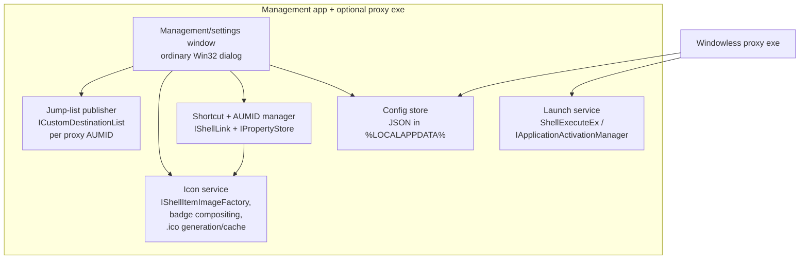

# Architecture

- Date: 2026-08-13
- Status: **primary design selected — conditionally.** Native taskbar pins as launcher
  proxies. Overlay, flyout, appbar, window-reparenting and
  injection approaches are all **rejected** (see [§7](#7-rejected-alternatives) and
  ADR-0003, ADR-0006). **Spike S-3 is the go/no-go**: ADR-0006 is accepted
  provisionally and the selection stands only once S-3 passes on current builds;
  if it fails, this document is re-opened.

## 1. The mechanism

The launcher draws nothing on the taskbar. Each launcher is a **real Windows 11 taskbar
pin** — a proxy shortcut that:

- displays the **target application's icon and name**, with a small **launcher badge**
  composited into a corner of the icon (in the spirit of the shortcut-arrow overlay) so
  a launcher pin is visually distinguishable from a normally pinned application,
- **launches the target application** when clicked,
- carries a **distinct AppUserModelID (AUMID)** so the launched app appears as its
  **own separate taskbar button**, and the pin **never expands in place** (expected
  behavior — spike S-3 is the go/no-go, §2),
- offers a **launcher-specific right-click menu** via the pin's **Jump List tasks**
  (edit name/icon, add another launcher, remove this launcher — see §4.1).

No overlay window, no flyout panel, no notification-area icon, no drawing over the
taskbar, no code injected into `explorer.exe`. The only surfaces used are the documented
shell shortcut + AUMID mechanisms — the same ones the Start menu and normal pins use.

## 2. How a proxy pin works

Taskbar grouping and pin identity are keyed on **AUMID, not the executable path**
([Microsoft `appids` docs](https://learn.microsoft.com/windows/win32/shell/appids)).
So:

- The proxy shortcut gets an explicit `System.AppUserModel.ID` (e.g.
  `PinnedLauncher.Proxy.<slug>`), set via `IPropertyStore` **before** pinning. This overrides
  the identity Windows would otherwise compute from the shortcut's target — which is
  precisely what stops the pin from being treated as the same taskbar entity as the
  running app.
- Icon and label come from the shortcut (`IconLocation` / display name). With a
  shortcut present these are authoritative — Microsoft's AUMID guidance says to use
  the shortcut's own command/icon/text rather than window-level
  `System.AppUserModel.Relaunch*` properties, which exist for windows *without* a
  shortcut.
- The launched target lands under its **own** identity — explicit if the target sets
  one, system-computed otherwise (see below) — which differs from the proxy's AUMID,
  so Windows shows it as a **separate** button instead of merging it into the pin
  (expected behavior — the S-3 go/no-go, below).

### The launcher badge

The taskbar does **not** render the standard shortcut-arrow overlay on pins, and
`ITaskbarList3::SetOverlayIcon` only applies to *running windows'* buttons — neither
helps a static pin. But since we **generate the icon file ourselves**, the badge is
simply **baked in**: the icon service extracts the target's icon at every size
(16→256 px), composites a small launcher glyph into a corner (scaled per size — at
16 px a simplified mark), and writes the multi-size `.ico` the proxy `.lnk` points to.
The badge is therefore pure image composition — no API dependency, nothing that can
break. It should be user-configurable (on/off, corner) since it is our own pixel data.

### The identity-propagation subtlety (spike S-3, central go/no-go)

A window's taskbar identity is either an explicit AUMID the target sets itself, or a
system-computed identity derived from the executable and its launch context. **There
is no documented API by which one process can set another application's AUMID** — the
setters (`SetCurrentProcessExplicitAppUserModelID`, window property stores) apply only
to the calling process and its own windows. The proxy therefore cannot *force* the
target's identity. What it can do is **decouple**: because the target is launched by
the proxy as a fresh shell activation (not directly by the pinned shortcut), the pin's
shortcut AUMID is not part of the target's launch context, and the target lands under
its own identity — explicit if it sets one, system-computed otherwise — which differs
from the proxy's AUMID.

That decoupling is an **expected behavior, not a documented guarantee**, and
establishing it per target class (packaged app, plain Win32 exe, exe with its own
AUMID) on every C-2-supported build is exactly spike S-3 — including the flavor-A failure
mode where a directly-linked target associates with the pin's shortcut AUMID and
merges into it. Sampling cannot prove the property for *arbitrary* targets; the
containment is that any failure is per-launcher, cosmetic (the pin expands in place —
i.e. stock Windows behavior, our baseline complaint but nothing worse), and
addressable by adjusting that launcher's proxy configuration.

## 3. Two implementation flavors

| | A — Direct shortcut | B — Windowless proxy exe *(recommended)* |
|---|---|---|
| Pin `.lnk` targets | the app directly | a tiny `PinnedLauncher.exe` |
| Process of ours at click | none | one, windowless, exits immediately |
| Per-launch logic (args, working dir, `runas` elevation, run-mode, focus-if-running) | ❌ baked into the `.lnk` only | ✅ full control |
| AUMID non-merge | relies on target having its own identity (risk, §2) | ✅ decouples the pin's shortcut identity from the target's launch (§2) |
| Complexity | minimal | small |

Flavor **B** is recommended: a windowless proxy shows no taskbar button of its own,
decouples the target's launch from the pin's shortcut identity (§2), and unlocks
per-launcher behavior (UC-5, UC-6). Flavor A stays available for targets that already
carry a clean AUMID and need no launch options.

## 4. Shared core

- **Config store** — human-readable JSON (NF-12): per launcher the target, **display
  name**, args, working dir, icon override, elevation/run-mode, generated AUMID, proxy
  `.lnk` path, and a persisted **lifecycle state**: `active` · `awaiting-repin` ·
  `pending-removal` · `removing` · `removed` (terminal tombstone, full-uninstall only).
  State transitions commit **atomically with the operation that requires them**:
  a visual edit's config commit writes `awaiting-repin` in the same write (not when
  the user later defers), and removal intent transitions to `removing` **before** the
  irreversible unpin step — so a crash at any point leaves a state reconciliation acts
  on (resume removal, re-offer re-pin), never a stale `active`. Custom display names
  live here, so every derived artifact (including the name) is regenerable from
  config alone.
- **Icon service** — extracts the target's shell icon (`IShellItemImageFactory`, works
  for exe/lnk/documents/packaged apps), composites the launcher badge (§2), writes the
  multi-size `.ico` the `.lnk` points to, refreshes when the target's icon changes.
- **Shortcut + AUMID manager** — creates/updates the proxy `.lnk` (`IShellLink`), stamps
  the explicit AUMID (`IPropertyStore`; the shortcut's own icon/name are authoritative
  — no `Relaunch*` properties, per the AUMID guidance in §2), places it where the
  shell will pin it (per-user Start-menu Programs folder).
- **Jump-list publisher** — builds each launcher's right-click menu (§4.1) via
  `ICustomDestinationList` keyed to that launcher's AUMID.
- **Launch service** — `ShellExecuteEx` for Win32 targets (honoring args/working
  dir/`runas`), `IApplicationActivationManager::ActivateApplication` for AUMID targets.
  **Elevation rule (confused-deputy guard):** the proxy always runs at medium
  integrity and applies elevation to the *resolved target* via `runas`, so the UAC
  prompt names the target. The proxy **never executes config-derived commands while
  itself elevated** — if started elevated (e.g. native Ctrl+Shift+click on the pin),
  it refuses and points the user at the supported per-launcher elevation (UC-6, S-6).
- **Management window** — the project's only built UI: a *normal* Win32 window (opened
  on demand from its Start entry or the pins' jump-list tasks; single-instance; no
  background presence), **never** anything positioned over the taskbar. Add / edit /
  remove / configure launchers, guided pin flow. Full design:
  [management-window.md](management-window.md); technology decision: ADR-0010
  (plain Win32 + common controls, MVP split with unit-tested presenters).
- **Transactionality & reconciliation** — the config store is the **single source of
  truth**; icons, proxy shortcuts and jump lists are derived, regenerable artifacts.
  Creation/edit pipeline order: compose icon → write shortcut → commit jump list →
  commit config. For a **create**, mid-pipeline failure rolls back the artifacts made
  so far in reverse order and the config is left uncommitted. For an **edit**, new
  artifact content is staged and the config commits last, so a failure leaves the
  *previous* config authoritative — and since artifacts are derived, "rollback" is
  simply regeneration from that config (no undo journal needed). The management window
  additionally **reconciles at each start** (regenerates missing/stale artifacts from
  config, flags orphans), so an interrupted operation never leaves permanent debris.
  Reconciliation is **state-aware**: `removing` and `pending-removal` entries resume
  their removal flow, `awaiting-repin` entries re-offer the pin guide, `removed`
  tombstones re-open the interrupted uninstall summary awaiting its final
  confirmation (UC-13) — only `active` entries regenerate artifacts.

### 4.1 Per-launcher right-click menu (Jump List tasks)

Right-clicking a taskbar pin opens its **Jump List**. Because every proxy pin has its
own AUMID, every launcher gets its **own** menu: the management app calls
[`ICustomDestinationList`](https://learn.microsoft.com/windows/win32/api/shobjidl_core/nn-shobjidl_core-icustomdestinationlist)
— `SetAppID(<proxy AUMID>)` → `BeginList` → `AddUserTasks(IObjectArray of IShellLink)`
→ `CommitList` — whenever a launcher is created or edited. Microsoft's docs confirm the
key property we rely on: **tasks are available even when the application is not
running**, which is exactly the state of a pure launcher pin.

Planned tasks (each an `IShellLink` to our exe with arguments — arguments are mandatory
for jump-list tasks):

| Task | Command |
|---|---|
| **Change name or icon…** | `PinnedLauncher.exe --edit <slug>` (opens the management window on that launcher) |
| **Add a new launcher…** | `PinnedLauncher.exe --add` |
| *(separator — `System.AppUserModel.IsDestListSeparator`)* | |
| **Open target's folder** | `PinnedLauncher.exe --open-location <slug>` |
| **Run as administrator** | `PinnedLauncher.exe --launch <slug> --elevated` |
| *(separator)* | |
| **Remove this launcher** | `PinnedLauncher.exe --remove <slug>` (guided unpin first, then artifact deletion — §5) |

*Open target's folder* and *Run as administrator* are published **only for launchers
whose resolved target kind supports them** (capability matrix,
[management-window §5.2](management-window.md)); the other tasks are universal.

Known bounds of the mechanism (by design of Windows, all acceptable):
- The system entries (the launcher's own name to launch it, *Unpin from taskbar*)
  cannot be removed and appear below our tasks — consistent with every other pin.
- The Tasks category header and its position are fixed; tasks can't be pinned/removed
  by the user; the list should stay static per launcher (it is — it only changes when
  the launcher itself is edited).

On launcher removal and on full uninstall, the publisher calls
[`ICustomDestinationList::DeleteList`](https://learn.microsoft.com/windows/win32/api/shobjidl_core/nf-shobjidl_core-icustomdestinationlist-deletelist)
for the launcher's AUMID — the operation Microsoft designates for clearing an app's
jump list at uninstall — so no custom task list outlives its launcher.

### 4.2 Editing a pinned launcher (name / icon)

There is **no documented API to modify an existing pin**. When the user pins a
shortcut, the shell keeps its own copy (historically under
`…\User Pinned\TaskBar`); rewriting that copy is undocumented shell storage, which
this design must not rely on (same no-fragile-internals principle as ADR-0003).

- **Guaranteed path (default):** edit = regenerate the Start-menu proxy `.lnk` and its
  icon, then guide the user through a quick re-pin (unpin → pin), reusing the
  pin-guide dialog. Supported end-to-end; costs one extra gesture.
- **Best-effort enhancement (spike S-5):** investigate whether updating the *source*
  shortcut plus `SHChangeNotify`/icon-cache refresh propagates to the pin without a
  re-pin gesture. If S-5 finds a reliable, low-risk mechanism it is layered on top;
  otherwise the guaranteed path stands alone. In no outcome does undocumented pin
  storage become the primary mechanism.

The two hardest, most update-fragile modules of the rejected overlay design — the
over-taskbar renderer and the live shell-geometry/z-order monitor — **do not exist in
this architecture**. Robustness comes from delegating placement and rendering to the
OS's own pinning.

## 5. Setup flow (one pin gesture per launcher — manual baseline, S-8 may lift it)

No documented API *silently* pins an arbitrary app. `TaskbarManager` does expose
consent-gated request APIs beyond the calling app — notably
`RequestPinAppListEntryAsync` — whose applicability to our generated Start entries
from an unpackaged app is unresolved and evaluated in **spike S-8**
([feasibility §3](feasibility.md#3-platform-constraints-from-official-documentation)).
Until S-8 proves otherwise, the plan assumes the manual gesture:

1. User adds a launcher in the management UI (picks the target; we read its icon + name)
   — or picks *Add a new launcher…* from any existing launcher pin's jump list.
2. We generate the badged icon and the proxy `.lnk` (target icon + name + badge, custom
   AUMID) in the per-user Start-menu Programs folder, and commit the launcher's jump
   list for that AUMID. Every generated artifact references only the **stable install
   location** (`%LOCALAPPDATA%\PinnedLauncher\bin` — release-plan §1): the app installs itself
   there on first run, so pins never point into a transient folder and zip upgrades
   overwrite in place without breaking them.
3. The pin is applied **once**: baseline flow is the guided user gesture (right-click
   the Start entry → *Pin to taskbar*); whether a consent-gated programmatic request
   (`RequestPinAppListEntryAsync`) can replace the gesture for our generated entries
   is exactly **spike S-8's question** — the flow upgrades if S-8 answers yes.
4. Thereafter: reorder by native drag within the pinned group; edit name/icon from the
   pin's own jump list (§4.2). **Removal is ordered to minimize dead pins:** unpin
   *first* — programmatic (`IStartMenuPinnedList::RemoveFromList`, if S-4 validates
   it) or guided, with the pinned-copy watcher as best-effort observation — and only
   then delete the jump list (`DeleteList`), the proxy `.lnk`, the generated icon, and
   the config entry. If the unpin is deferred, artifacts are retained and the launcher
   is marked *pending removal*. Because the watcher can be wrong, there are two safety
   nets: a proxy invoked with an unknown/removed slug shows a brief native message
   offering cleanup instead of failing silently, and reconciliation (§4) surfaces any
   pin whose artifacts are missing for repair or final cleanup. Deleting the stable
   install location itself (full uninstall, UC-13) is authorized only by the user's
   explicit end-of-summary confirmation that no launcher pins remain — never by
   watcher state alone.

This one-time gesture per launcher — manual for now, possibly a consent dialog if S-8
lands — is the price of using the real, robust taskbar mechanism instead of drawing
our own bar.

## 6. Requirements coverage at a glance

| Requirement | Delivered? |
|---|---|
| A pinned taskbar button that acts as a launcher (F-1 core) | ✅ a real native pin |
| Shows the **target's icon and name** | ✅ (icon + display name on the proxy `.lnk`) |
| Click launches the target application (F-3) | ✅ |
| **Never expands in place** (the project's core motivation) | ✅ distinct AUMID → separate button *(confirm via S-3)* |
| Distinct from running applications (F-2) | ✅ separate identity **and** launchers cluster together in the pinned zone |
| Placement: after Start/Search, left of the running-app icons (F-1) | ✅ exactly where native pins live; user drags to fine-tune |
| Visually recognizable as a launcher (badge, like the link overlay) | ✅ badge baked into the generated `.ico` — pure image composition |
| Launcher-specific right-click menu (edit name/icon, add launcher, …) | ✅ per-AUMID Jump List tasks; works while nothing is running |

**Placement.** Native pins occupy the pinned-app zone — immediately after Start/Search
and to the left of the running (unpinned) app buttons — which is precisely the requested
location. Because these are real pins, the user drags them into the exact order they
want; the launcher does not and cannot force a position, which is the correct,
non-fragile behavior.

## 7. Rejected alternatives

| Approach | Why rejected |
|---|---|
| Overlay strip over the taskbar | Draws our own window over the taskbar — excluded by the project's no-taskbar-drawing rule (requirements non-goals, ADR-0005). |
| Tray-button + flyout panel | Drawn UI near the taskbar — same exclusion (ADR-0005). |
| AppBar docked strip (`SHAppBarMessage`) | A separate drawn bar, not the taskbar row — same exclusion. |
| Child window reparented into `Shell_TrayWnd` | Undocumented, fragile; against the no-injection spirit (ADR-0003). |
| Explorer injection / XAML hooking | Injection; update treadmill, AV false positives, upgrade blocks (ADR-0003). |
| One notification-area icon per launcher | Native, but not "pinned buttons" (the explicit requirement); small icons; each needs a manual show-from-overflow. Not needed — the pinned zone is the desired location. |

Full prior-art survey and evidence: [feasibility.md §4](feasibility.md#4-prior-art-survey).

## 8. Stack

Modern C++ (C++20+, Q-1), Win32 + COM (`IShellLink`, `IPropertyStore`,
`IShellItemImageFactory`, `ICustomDestinationList`, `ShellExecuteEx`, and
`IApplicationActivationManager` — a plain Win32 COM interface, created with
`CLSCTX_LOCAL_SERVER` from the short-lived proxy as its documentation requires, so
packaged-app activation survives the proxy's immediate exit). C++/WinRT only where a
needed API is genuinely WinRT-shaped (`TaskbarManager` evaluation in S-8; theme
queries).
No custom GPU rendering is required (the OS draws the pins); the only UI is the
management window — plain Win32 + common controls, MVP-structured
([management-window.md](management-window.md), ADR-0010). **No WinUI** (ADR-0004/0010),
**no .NET** (NF-1). CMake + MSVC, statically linked CRT, single per-user exe (plus the
tiny proxy exe if flavor B).

### 8.1 API availability floors (C-2)

Verified against Microsoft's documentation: **no API in this design is gated on a
Windows 11 release or edition.**

| API surface | Introduced | Implication for C-2 |
|---|---|---|
| `IShellLink`, `IPropertyStore` + AUMID properties, `ICustomDestinationList` (incl. `DeleteList`), `IStartMenuPinnedList`, `SetCurrentProcessExplicitAppUserModelID` | Windows 7 | present on every Windows 11 build |
| `IApplicationActivationManager` | Windows 8 | present on every Windows 11 build |
| `IShellItemImageFactory`, `TaskDialogIndirect`, `Shell_NotifyIcon` | Windows Vista or earlier | present on every Windows 11 build |
| `Windows.UI.Shell.TaskbarManager` (incl. `RequestPinAppListEntryAsync`; S-8) | Windows 10 1709, build 16299 | present on every Windows 11 build; desktop-app support probed at runtime via the `ITaskbarManagerDesktopAppSupportStatics` marker interface |
| Taskbar-pin **Limited Access Feature unlock removal** | servicing-gated: [KB5074105](https://support.microsoft.com/topic/85bd25de-894a-43eb-a19b-9a59d10f194b) (builds 26100.7705 / 26200.7705, Jan 2026) | the **only** build-dependent behavior: on builds without the update the LAF token is still required. Microsoft documents a runtime registry probe (`…\LimitedAccessFeatures\com.microsoft.windows.taskbar.pin`), so S-8's path degrades detectably at runtime — no static build floor needed |

Consequence: any in-support Windows 11 build on any desktop-taskbar edition **that
meets C-2's preconditions** (interactive desktop session; unpackaged Win32 execution
and user taskbar pinning permitted by policy) is a valid target; only the optional S-8
pin-request path varies by servicing level, and it self-detects.

Design style: OOP with inheritance where it is the natural fit, KISS otherwise
(Q-2/Q-3, ADR-0007). Every OS boundary in the diagram above (shortcut manager, icon
service, jump-list publisher, launch service, config I/O) sits behind an abstract
interface (Q-6) so the core is fully unit-testable without a live shell; requirements
are validated by QTs with a traceability matrix — semi-automated (guided prompts +
UI-Automation verification) where the shell demands a user gesture (Q-4/Q-5,
ADR-0008/0009). Test environment: Catch2 v3 + trompeloeil + CTest, coverage via Visual
Studio 2026's built-in tooling (ADR-0009).

## 9. Open questions / spikes

- **S-3 (central):** AUMID non-merge + identity propagation across app types, on every
  supported build family (C-2) —
  does the pin reliably stay a pure launcher while the target opens as its own button?
- **S-4:** the pin/unpin lifecycle: smoothest guided one-time pin (Start-menu entry +
  user pin), reliability of pinned-copy detection, and — on the unpin side — whether
  [`IStartMenuPinnedList::RemoveFromList`](https://learn.microsoft.com/windows/win32/api/shobjidl/nf-shobjidl-istartmenupinnedlist-removefromlist)
  (documented for uninstall-time unpinning of an app's own shortcuts) works for our
  proxy shortcuts on current Windows 11 builds, enabling fully programmatic removal.
- **S-5:** whether icon/name updates to the **source** shortcut propagate to an
  existing pin (icon cache + `SHChangeNotify`) without a re-pin — the §4.2 best-effort
  enhancement only; the guaranteed regenerate-and-re-pin path does not depend on this
  spike. Includes badge recomposition on target-icon change.
- **S-6:** elevation semantics — medium-IL proxy applying `runas` to the resolved
  target (UAC names the target, no double UAC, no lingering proxy button), and the
  confused-deputy guard: reliable detection of an elevated-started proxy and the
  refuse-and-explain path (UC-6).
- **S-7:** confirm jump-list tasks committed for a proxy AUMID render on the pin's
  right-click menu on the supported builds (C-2) with no process running (documented
  behavior — quick sanity check).
- **S-8:** evaluate `Windows.UI.Shell.TaskbarManager` — `RequestPinAppListEntryAsync`,
  secondary-tile pin/update/unpin, `IsPinningAllowed` — as a possible replacement for
  the manual pin gesture: does it work from an unpackaged app, can it target our
  generated Start entries, and how does behavior differ across servicing levels
  (LAF token required below KB5074105; Microsoft's documented registry probe and the
  `ITaskbarManagerDesktopAppSupportStatics` check make this runtime-detectable —
  §8.1)? Outcome feeds §5 and the pin guide.
- **S-9:** validate the UIA test oracle — can UI Automation reliably distinguish the
  persistent launcher pin from a same-named running-target button? — **on every
  supported build family** (the same matrix it qualifies), and define the
  test-environment hygiene the QTs need (dedicated profile/VM, reserved test-AUMID
  namespace, teardown, failed-run recovery). The oracle is **revalidated whenever the
  matrix gains a new build family**. Details: ADR-0009 and the P2 test plan.
