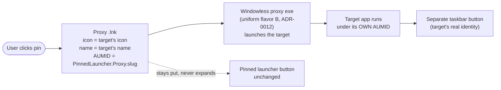
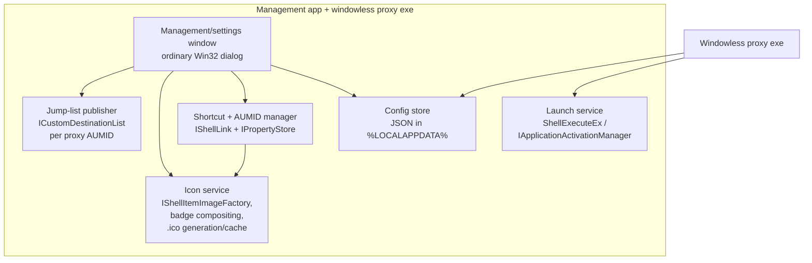

# Architecture

- Date: 2026-08-13
- Status: **primary design selected and spike-verified.** Native taskbar pins as
  launcher proxies. Overlay, flyout, appbar, window-reparenting and
  injection approaches are all **rejected** (see [§7](#7-rejected-alternatives) and
  ADR-0003, ADR-0006). The S-3 go/no-go **passed** (GO recorded 2026-08-15, family
  26200; ADR-0006 annotated) and every P0 spike carries an accepted outcome — §9
  is the outcome ledger. Implementation flavor **decided: uniform B**
  ([ADR-0012](adr/0012-uniform-flavor-b.md), 2026-08-16).

## 1. The mechanism

The launcher draws nothing on the taskbar. Each launcher is a **real Windows 11 taskbar
pin** — a proxy shortcut that:

- displays the **target application's icon and name**, with a small **launcher badge**
  composited into a corner of the icon (in the spirit of the shortcut-arrow overlay) so
  a launcher pin is visually distinguishable from a normally pinned application,
- **launches the target application** when clicked,
- carries a **distinct AppUserModelID (AUMID)** so the launched app appears as its
  **own separate taskbar button**, and the pin **never expands in place** (expected
  behavior — spike S-3 is the go/no-go, §2),
- offers a **launcher-specific right-click menu** via the pin's **Jump List tasks**
  (edit name/icon, add another launcher, remove this launcher — see §4.1).

No overlay window, no flyout panel, no notification-area icon, no drawing over the
taskbar, no code injected into `explorer.exe`. The only surfaces used are the documented
shell shortcut + AUMID mechanisms — the same ones the Start menu and normal pins use.

## 2. How a proxy pin works

Taskbar grouping and pin identity are keyed on **AUMID, not the executable path**
([Microsoft `appids` docs](https://learn.microsoft.com/windows/win32/shell/appids)).
So:

- The proxy shortcut gets an explicit `System.AppUserModel.ID` (e.g.
  `PinnedLauncher.Proxy.<slug>`), set via `IPropertyStore` **before** pinning. This overrides
  the identity Windows would otherwise compute from the shortcut's target — which is
  precisely what stops the pin from being treated as the same taskbar entity as the
  running app.
- Icon and label come from the shortcut (`IconLocation` / display name). With a
  shortcut present these are authoritative — Microsoft's AUMID guidance says to use
  the shortcut's own command/icon/text rather than window-level
  `System.AppUserModel.Relaunch*` properties, which exist for windows *without* a
  shortcut.
- The launched target lands under its **own** identity — explicit if the target sets
  one, system-computed otherwise (see below) — which differs from the proxy's AUMID,
  so Windows shows it as a **separate** button instead of merging it into the pin
  (expected behavior — the S-3 go/no-go, below).

### The launcher badge

The taskbar does **not** render the standard shortcut-arrow overlay on pins, and
`ITaskbarList3::SetOverlayIcon` only applies to *running windows'* buttons — neither
helps a static pin. But since we **generate the icon file ourselves**, the badge is
simply **baked in**: the icon service extracts the target's icon at every size
(16→256 px), composites a small launcher glyph into a corner (scaled per size — at
16 px a simplified mark), and writes the multi-size `.ico` the proxy `.lnk` points to.
The badge is therefore pure image composition — no API dependency, nothing that can
break. It should be user-configurable (on/off, corner) since it is our own pixel data.

### The identity-propagation subtlety (spike S-3, central go/no-go)

A window's taskbar identity is either an explicit AUMID the target sets itself, or a
system-computed identity derived from the executable and its launch context. **There
is no documented API by which one process can set another application's AUMID** — the
setters (`SetCurrentProcessExplicitAppUserModelID`, window property stores) apply only
to the calling process and its own windows. The proxy therefore cannot *force* the
target's identity. What it can do is **decouple**: because the target is launched by
the proxy as a fresh shell activation (not directly by the pinned shortcut), the pin's
shortcut AUMID is not part of the target's launch context, and the target lands under
its own identity — explicit if it sets one, system-computed otherwise — which differs
from the proxy's AUMID.

That decoupling is an **expected behavior, not a documented guarantee**, and
establishing it per target class (packaged app, plain Win32 exe, exe with its own
AUMID) on every C-2-supported build is exactly spike S-3 — including the flavor-A failure
mode where a directly-linked target associates with the pin's shortcut AUMID and
merges into it. Sampling cannot prove the property for *arbitrary* targets; the
containment is that any failure is per-launcher, cosmetic (the pin expands in place —
i.e. stock Windows behavior, our baseline complaint but nothing worse), and
addressable by adjusting that launcher's proxy configuration.

## 3. Two implementation flavors

| | A — Direct shortcut *(retired)* | B — Windowless proxy exe *(decided)* |
|---|---|---|
| Pin `.lnk` targets | the app directly | the tiny windowless proxy exe (`PinnedLauncherProxy.exe`, named in [design/cli.md](design/cli.md) §1; corrected 2026-08-16 — this cell previously wrote `PinnedLauncher.exe`, which is the management app) |
| Process of ours at click | none | one, windowless, exits immediately |
| Per-launch logic (args, working dir, `runas` elevation, run-mode, focus-if-running) | ❌ baked into the `.lnk` only | ✅ full control |
| AUMID non-merge | relies on target having its own identity (risk, §2) | ✅ decouples the pin's shortcut identity from the target's launch (§2) |
| Complexity | minimal | small |

**Decided (P0.3, 2026-08-16 — [ADR-0012](adr/0012-uniform-flavor-b.md)): flavor B
uniformly.** Every launcher's pin `.lnk` targets the windowless proxy: it shows no
taskbar button of its own, decouples the target's launch from the pin's shortcut
identity (§2), and carries all per-launch behavior (UC-5, UC-6, ADR-0011). Flavor A
is **retired** — S-3 showed it merges for plain Win32 targets, it cannot implement
the per-launch features, and it offers no platform-risk hedge B lacks (analysis in
ADR-0012). The table stays as the decision record; no flavor field, eligibility
detection, or A/B transition logic exists in the design.

## 4. Shared core

- **Config store** — human-readable JSON (NF-12): per launcher the target, **display
  name**, args, working dir, icon override, elevation/run-mode, generated AUMID, proxy
  `.lnk` path, and a persisted **lifecycle state**: `awaiting-pin` · `active` ·
  `awaiting-repin` · `pending-removal` · `removing` · `removed` (terminal tombstone,
  full-uninstall only). State transitions commit **atomically with the operation
  that requires them**: a create's config commit — last in the pipeline, so no pin
  can exist yet — writes `awaiting-pin` in the same write (NF-8's tracked-pending
  carrier, and where *API-only* parks on failure; cleared to `active` only when the
  watcher or the API confirmation observes the landed pin), a visual edit's config
  commit writes `awaiting-repin` in the same write (not when
  the user later defers), and removal intent transitions to `removing` **before** the
  irreversible unpin step — so a crash at any point leaves a state reconciliation acts
  on (resume removal, re-offer the pin or re-pin), never a stale `active`. Full
  state × event table: §4.3. Custom display names
  live here, so every derived artifact (including the name) is regenerable from
  config alone.
- **Icon service** — extracts the target's shell icon (`IShellItemImageFactory`, works
  for exe/lnk/documents/packaged apps), composites the launcher badge (§2), writes the
  multi-size `.ico` the `.lnk` points to, refreshes when the target's icon changes.
- **Shortcut + AUMID manager** — creates/updates the proxy `.lnk` (`IShellLink`), stamps
  the explicit AUMID (`IPropertyStore`; the shortcut's own icon/name are authoritative
  — no `Relaunch*` properties, per the AUMID guidance in §2), places it where the
  shell will pin it (per-user Start-menu Programs folder).
- **Jump-list publisher** — builds each launcher's right-click menu (§4.1) via
  `ICustomDestinationList` keyed to that launcher's AUMID.
- **Launch service** — `ShellExecuteEx` for Win32 targets (honoring args/working
  dir/`runas`), `IApplicationActivationManager::ActivateApplication` for AUMID targets.
  **Elevation rule (confused-deputy guard, ADR-0011):** the proxy runs at the
  session's default integrity and applies elevation to the *resolved target* via
  `runas`, so the UAC prompt names the target. The proxy **never executes
  config-derived commands across an elevation boundary** — guard predicate: refuse,
  before any config read, iff the token's elevation type is `Full` (i.e. the proxy
  itself was UAC-elevated, e.g. native Ctrl+Shift+click on the pin), pointing the
  user at the supported per-launcher elevation. Sessions without an elevation
  boundary (UAC off, built-in Administrator without Admin Approval Mode — elevation
  type `Default` at high IL) are **supported**: the guard deliberately never fires
  there, and the predicate self-adjusts if UAC returns (threat model and deferred
  0.7.x qualification: ADR-0011). UAC-enabled behavior verified in spike S-6,
  2026-08-15, [report](spikes/s6-elevation.md) — one UAC naming the target, every
  elevated-start vector detected and refused.
- **Management window** — the project's only built UI: a *normal* Win32 window (opened
  on demand from its Start entry or the pins' jump-list tasks; single-instance; no
  background presence), **never** anything positioned over the taskbar. Add / edit /
  remove / configure launchers, guided pin flow. Full design:
  [management-window.md](management-window.md); technology decision: ADR-0010
  (plain Win32 + common controls, MVP split with unit-tested presenters).
- **Transactionality & reconciliation** — the config store is the **single source of
  truth**; icons, proxy shortcuts and jump lists are derived, regenerable artifacts.
  Creation/edit pipeline order: compose icon → write shortcut → commit jump list →
  commit config. For a **create**, mid-pipeline failure rolls back the artifacts made
  so far in reverse order and the config is left uncommitted. For an **edit**, new
  artifact content is staged and the config commits last, so a failure leaves the
  *previous* config authoritative — and since artifacts are derived, "rollback" is
  simply regeneration from that config (no undo journal needed). The management window
  additionally **reconciles at each start** (regenerates missing/stale artifacts from
  config, flags orphans), so an interrupted operation never leaves permanent debris.
  Reconciliation is **state-aware**: `removing` and `pending-removal` entries resume
  their removal flow, `awaiting-pin` and `awaiting-repin` entries re-offer the pin
  guide, `removed` tombstones re-open the interrupted uninstall summary awaiting its
  final confirmation (UC-13) — and artifacts are regenerated for **every state whose
  next step needs them on disk** (`active`, `awaiting-pin`, `awaiting-repin`), so
  config alone always suffices to recover (§4.3).

### 4.1 Per-launcher right-click menu (Jump List tasks)

Right-clicking a taskbar pin opens its **Jump List**. Because every proxy pin has its
own AUMID, every launcher gets its **own** menu: the management app calls
[`ICustomDestinationList`](https://learn.microsoft.com/windows/win32/api/shobjidl_core/nn-shobjidl_core-icustomdestinationlist)
— `SetAppID(<proxy AUMID>)` → `BeginList` → `AddUserTasks(IObjectArray of IShellLink)`
→ `CommitList` — whenever a launcher is created or edited. Microsoft's docs confirm the
key property we rely on: **tasks are available even when the application is not
running**, which is exactly the state of a pure launcher pin. Verified in spike S-7
(2026-08-15, [report](spikes/s7-jumplist.md)): a list committed for the proxy AUMID
**before any pin existed** renders on the pin's jump list with no process of ours
running — tasks above the system entries, separators included — clicked tasks invoke
the target with their stored arguments, a re-commit replaces the menu with no
staleness, and `DeleteList` removes it; full S_OK API trace on 26200.

Planned tasks (each an `IShellLink` to our exe with arguments — arguments are mandatory
for jump-list tasks):

| Task | Command |
|---|---|
| **Change name or icon…** | `PinnedLauncher.exe --edit <slug>` (opens the management window on that launcher) |
| **Add a new launcher…** | `PinnedLauncher.exe --add` |
| *(separator — `System.AppUserModel.IsDestListSeparator`)* | |
| **Open target's folder** | `PinnedLauncher.exe --open-location <slug>` |
| **Run as administrator** | `PinnedLauncher.exe --launch <slug> --elevated` |
| *(separator)* | |
| **Remove this launcher** | `PinnedLauncher.exe --remove <slug>` (unpin first — programmatic, fallback per UC-3 — then artifact deletion — §5) |

*Open target's folder* and *Run as administrator* are published **only for launchers
whose resolved target kind supports them** (capability matrix,
[management-window §5.2](management-window.md)); the other tasks are universal.

Known bounds of the mechanism (by design of Windows, all acceptable):
- The system entries (the launcher's own name to launch it, *Unpin from taskbar*)
  cannot be removed and appear below our tasks — consistent with every other pin.
- The Tasks category header and its position are fixed; tasks can't be pinned/removed
  by the user; the list should stay static per launcher (it is — it only changes when
  the launcher itself is edited).

On launcher removal and on full uninstall, the publisher calls
[`ICustomDestinationList::DeleteList`](https://learn.microsoft.com/windows/win32/api/shobjidl_core/nf-shobjidl_core-icustomdestinationlist-deletelist)
for the launcher's AUMID — the operation Microsoft designates for clearing an app's
jump list at uninstall — so no custom task list outlives its launcher.

### 4.2 Editing a pinned launcher (name / icon)

There is **no documented API to modify an existing pin**. When the user pins a
shortcut, the shell keeps its own copy (historically under
`…\User Pinned\TaskBar`); rewriting that copy is undocumented shell storage, which
this design must not rely on (same no-fragile-internals principle as ADR-0003).

- **Guaranteed path (default):** edit = regenerate the Start-menu proxy `.lnk` and its
  icon, then re-pin (unpin → pin), reusing the pin-guide dialog: the unpin leg is
  **programmatic first** (S-4 `RemoveFromList`, UC-3's fixed mechanism, gesture
  fallback), the pin leg follows the configured pin-flow mode (management-window
  §5.3). Supported end-to-end; gesture budget: **zero** on the API path, worst
  case **two** (unpin + pin) in *manual* or when both legs fall back.
- **Best-effort enhancement — rejected (spike S-5, 2026-08-15,
  [report](spikes/s5-editprop.md)):** no documented nudge propagates a source-shortcut
  edit or an in-place icon rewrite to an existing pin — every `SHChangeNotify` form
  tried (item/dir/image/assoc, including on the pinned copy) and `ie4uinit -show`
  all failed; only an Explorer restart refreshes, proving the staleness is
  icon-cache-level rather than pin-baked. The guaranteed path stands alone. Two
  rules the spike fixed for the icon service: regenerated icon artifacts keep a
  **stable path** (the pinned copy references it forever — an in-place rewrite
  heals at the next Explorer session, a renamed file would break the pin's icon
  permanently), and the `IShellLink`-based edit path preserves the AUMID property
  store (verified).

The two hardest, most update-fragile modules of the rejected overlay design — the
over-taskbar renderer and the live shell-geometry/z-order monitor — **do not exist in
this architecture**. Robustness comes from delegating placement and rendering to the
OS's own pinning.

### 4.3 Lifecycle state machine

One row per persisted state; reconciliation at each management-window start replays
the same transitions from whatever a crash left behind. *Regenerate* = derived
artifacts rebuilt from config (stable icon path, §4.2). Three bookkeeping rules make
the table total: **removal records its origin** (the state held when removal was
requested, persisted alongside the state and consumed by *Cancel*), **removal
records its kind** (`removalKind: normal | uninstall`, persisted atomically with
the removal transition and consumed at completion — after a crash, reconciliation
resumes the right flavor from the field, never from guesswork), and **removal
never infers pin absence from the state** — the unpin-first leg (programmatic
`RemoveFromList`, tolerant when no pin exists; gesture fallback; copy-absence
verified) runs for **every** origin, because `awaiting-pin`/`awaiting-repin` are
cleared by best-effort observation and a pin may have landed unobserved.

| State | Meaning | Pin / re-pin observed | Reconcile at start | Removal requested | Cancel removal |
|---|---|---|---|---|---|
| `awaiting-pin` | created or imported (UC-8), or a re-pin whose unpin leg completed — pin not yet landed (deferred guide, API denial, *API-only* parking) | → `active` | pinned copy already present → `active` (unobserved landing); else regenerate + re-offer the pin guide (NF-8) | → `pending-removal` (deferred) / `removing` (immediate), origin + kind recorded | — |
| `active` | pinned, healthy | — | regenerate missing/stale artifacts | → `pending-removal` / `removing`, origin + kind recorded | — |
| `awaiting-repin` | visual edit committed; the stale pin still shows the old look (S-5) — the **unpin-pending** phase | old copy's observed **disappearance** → `awaiting-pin` (persisted, atomic with the observation; the pin leg then proceeds under that row — management-window §5.3) | copy absent → phase 1 completed unobserved: → `awaiting-pin`; copy present → the stale pin: regenerate + re-offer the unpin leg (NF-8) | → `pending-removal` / `removing`, origin + kind recorded | — |
| `pending-removal` | removal requested, unpin deferred — initially, or after a failed programmatic attempt in `removing`; origin + kind persisted | — | retain artifacts; re-offer resume | resume → `removing` | → **origin state** (nothing irreversible has happened; the origin's own reconcile rule re-normalizes at next start) |
| `removing` | removal in progress; written **before** the irreversible unpin; origin + kind persisted | — | resume removal | — | **reconcile-then-branch**: pinned copy present → **origin state** (an `awaiting-repin` origin keeps its owed re-pin); absent → `awaiting-pin`, regenerate, re-offer — never a blind `active` |
| `removed` | uninstall tombstone (UC-13 only) | — | re-open the uninstall summary | — | — |

Removal **completion** branches on the persisted `removalKind`: `normal` (UC-3)
deletes the config entry outright once the artifacts are gone; `uninstall` (UC-13)
transitions to the `removed` tombstone instead, awaiting the end-of-summary
confirmation. One further transition keeps UC-3's defer path reachable: in
`removing`, a confirmed programmatic-unpin failure followed by the user deferring
the gesture returns the entry to `pending-removal` (origin + kind preserved; the
gesture is re-offered later, NF-8). **Import normalization (UC-8):** imported
entries always enter `awaiting-pin` — pin gestures cannot be imported — and the
first reconciliation promotes to `active` any entry whose pin is already observed
**and** whose pin-visible fields (name / icon source; badge excluded since
2026-08-16, the soft-badge P1 decision in design/config-schema.md §4) match that pin; an
overlapping import that changes pin-visible fields enters `awaiting-repin` instead
(UC-5's re-pin rule applies to imports too). In merge mode, existing entries keep
their current state. A **native
unpin** noticed at reconciliation (pinned copy absent for an `active` entry) is
surfaced as a flagged repair — confirm → `awaiting-pin`, re-offer the pin — never an
automatic transition, because the watcher is best-effort (§5.1 heuristic).
Ownership: states + state-aware reconciliation are **0.3** deliverables (they guard
the pipeline from the first dogfooding day); the re-offer UI is **0.4** (NF-8's QTs
split accordingly).

## 5. Setup flow (one pin consent per launcher — API-first, gesture fallback; S-8)

No documented API *silently* pins an arbitrary app — every path is user-consented.
**Spike S-8** ([spikes/s8-pinapi.md](spikes/s8-pinapi.md), 2026-08-15) resolved the
evaluation: from our unpackaged exe, `TaskbarManager.RequestPinCurrentAppAsync`
pins a generated Start entry when the requesting process assumes that entry's
**explicit AUMID** — one consent dialog carrying the launcher's name and icon, and
the landed pin is equivalent to a gesture pin on both the S-4 and S-9 oracles
(S-4's `RemoveFromList` unpins it, too). The alternatives are closed:
`RequestPinAppListEntryAsync` and the secondary-tile APIs fail with `0x8000000E`
*caller must have package identity*. The flow is therefore **API-first with the
guided gesture as fallback**, and the posture is a runtime **pin-flow setting**
(*API-first* default / *API-only* / *manual*; mode semantics:
management-window §5.3) — the project rule inaugurated by S-8: wherever Windows
offers alternative mechanisms **whose user experience differs** (here: consent
dialog vs manual gesture), the choice is a setting, so behavior can be re-tuned
if Windows changes without waiting for a release. Invisible fallback orderings
with no experiential difference — e.g. UC-3's silent `RemoveFromList` unpin
with the gesture only on failure — are the fixed flow, not settings (Q-3).

1. User adds a launcher in the management UI (picks the target; we read its icon + name)
   — or picks *Add a new launcher…* from any existing launcher pin's jump list.
2. We generate the badged icon and the proxy `.lnk` (target icon + name + badge, custom
   AUMID) in the per-user Start-menu Programs folder, and commit the launcher's jump
   list for that AUMID. Every generated artifact references only the **stable install
   location** (`%LOCALAPPDATA%\PinnedLauncher\bin` — release-plan §1): the app installs itself
   there on first run, so pins never point into a transient folder and zip upgrades
   overwrite in place without breaking them.
3. The pin is applied **once**, per the configured pin-flow mode. Default
   (*API-first*): a short-lived helper — the **proxy exe in its pin-request verb**
   (`--request-pin <slug>`: assuming a per-launcher AUMID is the proxy's native
   profile, and NF-1's two-executable budget admits no third binary; NF-2's
   exits-immediately bound applies to the *launch* verb, this verb lives for the
   consent dialog) — assumes the launcher's AUMID and calls
   `RequestPinCurrentAppAsync`, launched from a **foreground** interaction — the
   management window from 0.4, the interactive console at 0.3 (the shape S-8
   itself validated); either way activation rights transfer, while a
   background-launched helper just blinks on the taskbar — **gated on
   `IsCurrentAppPinnedAsync`** (S-8
   observed the consent dialog re-appearing on an already-pinned request, contra
   documented idempotency), and only when the S-8 runtime detection (§8.1: marker
   interface, foreground `IsPinningAllowed`, LAF registry probe) says the request
   can succeed. Failure behavior is the mode's defining axis: *API-first* falls
   back to the guided gesture (right-click the Start entry → *Pin to taskbar*);
   *API-only* parks the launcher in `awaiting-pin` (§4.3) with an
   explicit *Retry* and **never opens the gesture guide** (NF-8: pending is
   tracked and re-offered, never dropped); *manual* never probes the API. Full
   mode × outcome table: management-window §5.3.
4. Thereafter: reorder by native drag within the pinned group; edit name/icon from the
   pin's own jump list (§4.2). **Removal is ordered to minimize dead pins:** unpin
   *first* — programmatic (`IStartMenuPinnedList::RemoveFromList`, validated by
   S-4: `S_FALSE` = success class) or guided, with the pinned-copy watcher as
   best-effort observation — and only
   then delete the jump list (`DeleteList`), the proxy `.lnk`, the generated icon, and
   the config entry. If the unpin is deferred, artifacts are retained and the launcher
   is marked *pending removal*. Because the watcher can be wrong, there are two safety
   nets: a proxy invoked with an unknown/removed slug shows a brief native message
   offering cleanup instead of failing silently, and reconciliation (§4) surfaces any
   pin whose artifacts are missing for repair or final cleanup. Deleting the stable
   install location itself (full uninstall, UC-13) is authorized only by the user's
   explicit end-of-summary confirmation that no launcher pins remain — never by
   watcher state alone.

This one-time consent per launcher — a dialog on the API path, a gesture on the
fallback — is the price of using the real, robust taskbar mechanism instead of
drawing our own bar.

## 6. Requirements coverage at a glance

| Requirement | Delivered? |
|---|---|
| A pinned taskbar button that acts as a launcher (F-1 core) | ✅ a real native pin |
| Shows the **target's icon and name** | ✅ (icon + display name on the proxy `.lnk`) |
| Click launches the target application (F-3) | ✅ |
| **Never expands in place** (the project's core motivation) | ✅ distinct AUMID → separate button *(verified: S-3 GO, 2026-08-15)* |
| Distinct from running applications (F-2) | ✅ separate identity **and** launchers cluster together in the pinned zone |
| Placement: after Start/Search, left of the running-app icons (F-1) | ✅ exactly where native pins live; user drags to fine-tune |
| Visually recognizable as a launcher (badge, like the link overlay) | ✅ badge baked into the generated `.ico` — pure image composition |
| Launcher-specific right-click menu (edit name/icon, add launcher, …) | ✅ per-AUMID Jump List tasks; works while nothing is running |

**Placement.** Native pins occupy the pinned-app zone — immediately after Start/Search
and to the left of the running (unpinned) app buttons — which is precisely the requested
location. Because these are real pins, the user drags them into the exact order they
want; the launcher does not and cannot force a position, which is the correct,
non-fragile behavior.

## 7. Rejected alternatives

| Approach | Why rejected |
|---|---|
| Overlay strip over the taskbar | Draws our own window over the taskbar — excluded by the project's no-taskbar-drawing rule (requirements non-goals, ADR-0005). |
| Tray-button + flyout panel | Drawn UI near the taskbar — same exclusion (ADR-0005). |
| AppBar docked strip (`SHAppBarMessage`) | A separate drawn bar, not the taskbar row — same exclusion. |
| Child window reparented into `Shell_TrayWnd` | Undocumented, fragile; against the no-injection spirit (ADR-0003). |
| Explorer injection / XAML hooking | Injection; update treadmill, AV false positives, upgrade blocks (ADR-0003). |
| One notification-area icon per launcher | Native, but not "pinned buttons" (the explicit requirement); small icons; each needs a manual show-from-overflow. Not needed — the pinned zone is the desired location. |

Full prior-art survey and evidence: [feasibility.md §4](feasibility.md#4-prior-art-survey).

## 8. Stack

Modern C++ (C++20+, Q-1), Win32 + COM (`IShellLink`, `IPropertyStore`,
`IShellItemImageFactory`, `ICustomDestinationList`, `ShellExecuteEx`, and
`IApplicationActivationManager` — a plain Win32 COM interface, created with
`CLSCTX_LOCAL_SERVER` from the short-lived proxy as its documentation requires, so
packaged-app activation survives the proxy's immediate exit). C++/WinRT only where a
needed API is genuinely WinRT-shaped (the S-8-adopted `TaskbarManager` pin request;
theme queries).
No custom GPU rendering is required (the OS draws the pins); the only UI is the
management window — plain Win32 + common controls, MVP-structured
([management-window.md](management-window.md), ADR-0010). **No WinUI** (ADR-0004/0010),
**no .NET** (NF-1). CMake + MSVC, statically linked CRT, single per-user exe plus the
tiny proxy exe (uniform flavor B, ADR-0012).

### 8.1 API availability floors (C-2)

Verified against Microsoft's documentation: **no API in this design is gated on a
Windows 11 release or edition.**

| API surface | Introduced | Implication for C-2 |
|---|---|---|
| `IShellLink`, `IPropertyStore` + AUMID properties, `ICustomDestinationList` (incl. `DeleteList`), `IStartMenuPinnedList`, `SetCurrentProcessExplicitAppUserModelID` | Windows 7 | present on every Windows 11 build |
| `IApplicationActivationManager` | Windows 8 | present on every Windows 11 build |
| `IShellItemImageFactory`, `TaskDialogIndirect`, `Shell_NotifyIcon` | Windows Vista or earlier | present on every Windows 11 build |
| `Windows.UI.Shell.TaskbarManager` (`RequestPinCurrentAppAsync` — the S-8-adopted route; `RequestPinAppListEntryAsync`/secondary tiles are closed to unpackaged callers, `0x8000000E`) | Windows 10 1709, build 16299 | present on every Windows 11 build; desktop-app support probed at runtime via the `ITaskbarManagerDesktopAppSupportStatics` marker interface — **verified by S-8 on 26200.9168** (marker present, request lands, pin equivalent to a gesture pin) |
| Taskbar-pin **Limited Access Feature unlock removal** | servicing-gated: [KB5074105](https://support.microsoft.com/topic/85bd25de-894a-43eb-a19b-9a59d10f194b) (builds 26100.7705 / 26200.7705, Jan 2026) | the **only** build-dependent behavior: on builds without the update the LAF token is still required. Microsoft documents a runtime registry probe (`…\LimitedAccessFeatures\com.microsoft.windows.taskbar.pin`), so the S-8 path degrades detectably at runtime — no static build floor needed. **S-8 verified the probe on a post-KB build** (seed value absent ⇒ no token; token-less `TryUnlockFeature` agrees: `AvailableWithoutToken`); the pre-KB state is adopted on the documented semantics, the gesture fallback covering any surprise |

Consequence: any in-support Windows 11 build on any desktop-taskbar edition **that
meets C-2's preconditions** (interactive desktop session; unpackaged Win32 execution
and user taskbar pinning permitted by policy) is a valid target; only the optional S-8
pin-request path varies by servicing level, and it self-detects.

Design style: OOP with inheritance where it is the natural fit, KISS otherwise
(Q-2/Q-3, ADR-0007). Every OS boundary in the diagram above (shortcut manager, icon
service, jump-list publisher, launch service, config I/O) sits behind an abstract
interface (Q-6) so the core is fully unit-testable without a live shell; requirements
are validated by QTs with a traceability matrix — semi-automated (guided prompts +
UI-Automation verification) where the shell demands a user gesture (Q-4/Q-5,
ADR-0008/0009). Test environment: Catch2 v3 + trompeloeil + CTest, coverage via Visual
Studio 2026's built-in tooling (ADR-0009).

## 9. Spike ledger (P0.2 closed 2026-08-15 — all outcomes accepted)

Each P0 spike converted a "verify by testing" statement into recorded evidence: the
reports hold the data, the design sections above carry the folded-in results.
Standing duties that outlive P0 are marked ↻.

- **S-3 (was the go/no-go): AUMID non-merge + identity propagation — GO**
  ([report](spikes/s3-aumid.md) §7). Verified on family 26200 for plain-Win32,
  self-AUMID, and packaged targets under flavor B; flavor-A pins to plain Win32
  merge via target-path association — fed P0.3, decided as **uniform flavor B**
  (ADR-0012). ↻ 26100/28000 remain non-blocking confirmation runs (first entries
  of the P2 matrix); 22631 descoped (out of support 2026-11-10).
- **S-4: pin/unpin lifecycle — validated** ([report](spikes/s4-pinflow.md) §7).
  Pin guide deep-links via `SHOpenFolderAndSelectItems` on
  `shell:AppsFolder\<AUMID>` with the entry pre-selected; the
  `User Pinned\TaskBar` copy is a synchronous, route-independent pin signal (the
  Taskband blob is lazy — never used for live detection);
  [`IStartMenuPinnedList::RemoveFromList`](https://learn.microsoft.com/windows/win32/api/shobjidl/nf-shobjidl-istartmenupinnedlist-removefromlist)
  unpins our proxy shortcuts programmatically (`S_FALSE` = success class) → UC-3,
  §5.
- **S-5: icon/name edit propagation — live refresh rejected**
  ([report](spikes/s5-editprop.md) §7). No documented nudge (every
  `SHChangeNotify` form, `ie4uinit`) refreshes an existing pin — only an Explorer
  restart does; the §4.2 regenerate-and-re-pin guide stands alone. Icon artifacts
  keep a **stable path** so the pinned copy heals at the next session.
- **S-6: elevation semantics — verified** ([report](spikes/s6-elevation.md) §7).
  One UAC prompt naming the resolved target; all three elevated-start vectors
  detected and refused before any config read. Guard predicate adopted with
  boundary semantics in **ADR-0011** (UAC-off / built-in-Administrator supported;
  qualification at 0.7.x). Side finding: `shell:AppsFolder` indexing lag — the
  pin guide polls `ParseName` before deep-linking (§5, management-window §5.3).
- **S-7: jump-list tasks — verified** ([report](spikes/s7-jumplist.md) §7).
  Tasks committed for a proxy AUMID render above the system entries with no
  process of ours running, invoke the target with stored arguments, update on
  re-commit, vanish on `DeleteList` → §4.1, UC-7.
- **S-8: `TaskbarManager` pin APIs — adopted, API-first**
  ([report](spikes/s8-pinapi.md) §7). `RequestPinCurrentAppAsync` pins the
  generated Start entry via one consent dialog from the unpackaged helper
  assuming the launcher's AUMID; the landed pin is gesture-equivalent (S-4 + S-9
  oracles). `RequestPinAppListEntryAsync` and secondary tiles are closed to
  unpackaged callers (`0x8000000E`). Flow: **API-first with gesture fallback**,
  posture a setting (§5, §8.1; ADR-0006 annotated). Caveats: gate on
  `IsCurrentAppPinnedAsync`; the helper needs foreground activation.
- **S-9: UIA test oracle + hygiene — validated**
  ([report](spikes/s9-uiaoracle.md) §7). Taskbar buttons expose
  `AutomationId = "Appid: <AUMID>"` (pin) vs `"Window: 0x<hwnd>"` (running
  window); F-2 is asserted by element identity across states. Prefixes are
  undocumented — matched prefix-tolerantly. Hygiene: reserved
  `PinnedLauncher.Test.*` namespace — test sweeps match it **only**, never the
  product's `PinnedLauncher.Proxy.*` (S-9 report correction, 2026-08-16) —
  programmatic recovery sweep, gesture-free teardown. ↻ the oracle revalidates
  on every build family the P2 matrix gains (ADR-0009).
- **`shell:AppsFolder` enumeration check — done**
  ([report](spikes/appsfolder-enum.md)). 166 entries with names + AUMIDs in
  ≤ 0.5 s warm via the slow layer (upper bound); returned order unsorted (the
  picker sorts); packaged entries classified by `!`; confirmed as the picker's
  single source, no caching layer warranted.
