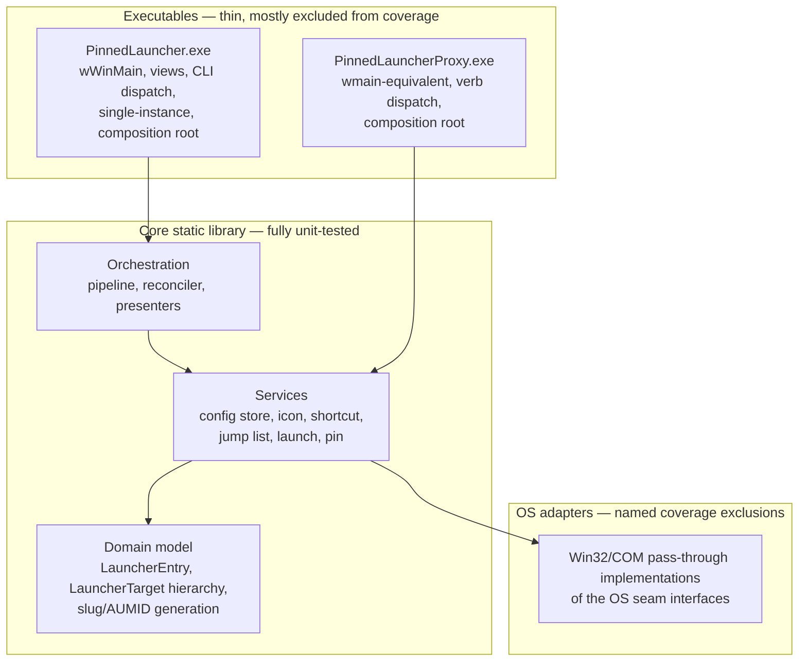

# Modules — class-level design

- Date: 2026-08-16
- Status: **accepted 2026-08-16** (P1 deliverable 4, [implementation-plan §P1](../implementation-plan.md#p1--detailed-design); review outcome: §11 accepted, item 1 recorded as ADR-0013, logging scoped to errors + state transitions with the §8 privacy rules; amended after external review, §11 note)
- Normative inputs: [requirements](../requirements.md) Q-1..Q-6, NF-2, NF-3, NF-9;
  [architecture §4](../architecture.md#4-shared-core) (services, pipeline,
  reconciliation), [§4.3](../architecture.md#43-lifecycle-state-machine)
  (state machine, normative), [§8](../architecture.md#8-stack) (stack);
  [management-window §4](../management-window.md#4-structure-q-2--q-6-thin-view-testable-presenter)
  (MVP split, normative for presenter shape), §5.3 (pin-guide state machine);
  [ADR-0007](../adr/0007-oop-style-inheritance-kiss.md) (style rules),
  [ADR-0008](../adr/0008-test-strategy-ut-coverage-qt.md) /
  [ADR-0009](../adr/0009-test-environment.md) (what must be mockable, and how),
  [ADR-0010](../adr/0010-management-window-win32-mvp.md),
  [ADR-0011](../adr/0011-elevation-guard-boundary.md),
  [ADR-0012](../adr/0012-uniform-flavor-b.md)
- Companion designs: [config-schema.md](config-schema.md),
  [aumid-scheme.md](aumid-scheme.md), [cli.md](cli.md)

## 1. Code layout

One static **core library** plus two thin executables (ADR-0012 fixes the
binary count; the core holds everything unit-testable):

- Everything lives in namespace `pl`. Interfaces are `I`-prefixed, per the COM
  surroundings.
- Ownership is top-down and boring (Q-3): each executable's **composition
  root** constructs the OS adapters, the services over them, and (manager
  only) the presenters over the services, all as `unique_ptr` members of one
  application object; everything below receives non-owning references.
  No DI container, no factories (ADR-0007).
- The composition root also performs the start-of-process duties fixed
  elsewhere: the ADR-0011 token check
  ([cli.md §5](cli.md#5-confused-deputy-guard-placement-adr-0011)), the version
  handshake (cli.md §6), single-instance forwarding (cli.md §2.1), and, in
  the manager, reconciliation before the window shows (§4.3).

## 2. Domain model

- **`LauncherEntry`**: plain data mirroring a config-schema §5 entry (slug,
  display name, target descriptor, options, lifecycle fields). No behavior
  beyond invariant checks; serialization lives in the config store (§4.1).
- **`LauncherTarget` hierarchy** (the ADR-0007 is-a case): abstract base with
  `Kind()`, `Capabilities()` (the management-window §5.2 matrix as data),
  `BuildLaunchSpec(const LauncherEntry&)` (verb, arguments, working directory,
  show command), and `IconSource()`. Derived: `ExeTarget` (including
  `.lnk`-to-exe), `PackagedTarget`, `DocumentTarget`, `FolderTarget`,
  `UrlTarget`, all `final`. A free factory classifies a config target
  descriptor into the right subclass (resolution rules: config-schema §5.1).
  Capability validation (config-schema §5.2) and launch-spec assembly are
  thereby pure, table-driven code: fully covered UT territory.
- **Identity generation**: free functions implementing aumid-scheme §3/§4
  (slug derivation, uniqueness suffixing, `.lnk` filename sanitization). Pure;
  exhaustively unit-tested against the documented examples.

## 3. The Q-6 seams

Two deliberate levels, each justified by a test double that exists today
(Q-3, ADR-0007):

- **Service interfaces**: what presenters, pipeline, reconciler, and the proxy
  consume; mocked in *their* unit tests (management-window §4 mandates this
  seam level).
- **OS seam interfaces**: thin Win32/COM facades injected into the concrete
  services, so each service's own logic is fully covered while the adapters
  are pure pass-through (the ADR-0008 named exclusions). Where the *sequence*
  of OS calls is the contract (jump-list commit order, `runas` verb usage),
  trompeloeil asserts interactions on exactly these seams (ADR-0009).
  **Deliberately not part of the P1 header set**: each OS seam's method list
  is shaped and committed with the service implementation that consumes it
  (release map, §10); the P1 skeletons fix the *service* surface that the
  rest of the system compiles against.

| Service interface | Key operations (sketch) | OS seams beneath the production impl |
|---|---|---|
| `IConfigStore` | `Load()` (returns the document **plus per-entry diagnostics** with array positions, so flagged entries are addressable per config-schema §7.2; raw preservation of flagged/unknown content is store-internal state carried into the next write), `Replace(doc)`, `UpdateEntry(slug, mutator)` (the atomic RMW config-schema §5.3 requires); proxy uses a read-only `Load()` | `IAtomicFileIo` (read-all, `ReplaceFile` write protocol of config-schema §7) |
| `IIconService` | `EnsureIcon(entry)` (compose and write `icons\<slug>.ico`, stable path, config-schema §6), `Preview(entry, sizes)` for the edit dialog, `Delete(slug)` (removal/uninstall, UC-3) | `IShellImageSource` (`IShellItemImageFactory` extraction); badge compositing and the multi-size `.ico` writer are pure code (golden-file UTs, 0.2) |
| `IShortcutManager` | `WriteProxyShortcut(entry)` (assemble properties, stamp AUMID), `RemoveShortcut(path)` (path form, so a rename can delete the **old** `.lnk` and reconciliation can clean an orphan the config no longer names), `ListProxyShortcuts()` (enumerate our Start-menu folder: the reconciler's orphan scan) | `IShellLinkApi` (`IShellLink` + `IPropertyStore` pass-through; property assembly itself is pure and interaction-asserted) |
| `IJumpListPublisher` | `Commit(entry)` (build the §4.1 task list), `Delete(aumid)` | `IJumpListApi` (`ICustomDestinationList`: the `BeginList` → `AddUserTasks` → `CommitList` order is the ADR-0009 interaction example) |
| `ILaunchService` | `Launch(entry, ForceElevation)` (UC-6 semantics; the flag serves cli.md's `--launch --elevated`; `.lnk` targets are resolved and merged per config-schema §5.1), `OpenLocation(entry)` | `IShellExecuteApi` (asserts verb `runas` reaches the call), `IAppActivationApi` (`IApplicationActivationManager`, `CLSCTX_LOCAL_SERVER`), `IShellLinkApi` (shared with the shortcut manager, for launch-time `.lnk` resolution) |
| `IPinService` | `IsPinPresent(aumid)` (S-4 pinned-copy signal), `ReadPinnedCopy(aumid)` (the copy's retained display name and icon path, S-9: what the UC-8 promotion comparison and the aumid-scheme §4 stale-residue check consume — presence alone never promotes), `Unpin(entry)` (`RemoveFromList`, `S_FALSE` is success class), `Watch(callback)` (§7 threading), `ProbeApiAvailability()` (S-8 marker + LAF probes), `RequestPin(slug)` (spawn the helper, map exit codes per cli.md §3.3) | `IPinFolderApi` (enumerate/watch `User Pinned\TaskBar`, read copies' property stores), `IStartMenuPinApi` (`IStartMenuPinnedList`), `IPinApiProbe` (registry + WinRT statics), `IProcessSpawner` |
| `IAppsFolder` | `Enumerate()` (the picker source, appsfolder-enum check), `IsIndexed(aumid)` (the S-6 lag poll), `RevealInAppsView(aumid)` (S-4 deep link) | `IShellFolderApi` |
| `ITokenInfo` | `QueryElevationType()` returning `Result<TokenElevation>` (the ADR-0011 predicate input; a failed query fails closed as `Full`, cli.md §5) | direct `GetTokenInformation` pass-through |

The proxy links the same core and consumes only `IConfigStore` (read path),
`ILaunchService`, `IPinService::RequestPin`'s in-process half, and
`ITokenInfo`: no manager-only code is reachable from the click path.

## 4. Core orchestration components

Concrete classes (no interfaces of their own: nothing substitutes them, Q-3),
tested against mocked services:

- **`LauncherPipeline`**: the create/edit sequence icon → shortcut → jump list
  → config commit with reverse-order rollback on failure and the
  state-carrying commits (`awaiting-pin` / `awaiting-repin`) exactly as
  architecture §4/§4.3 mandates. One public entry per flow: `Create(spec)`,
  `Edit(slug, spec)`, `Remove(slug, RemovalKind, deferred)`.
- **`Reconciler`**: the start-of-run replay of architecture §4.3's table:
  per-state artifact regeneration, unobserved-landing promotion (which
  compares the copy's visible properties via
  `IPinService::ReadPinnedCopy`, UC-8's match condition, never presence
  alone), removal resumption, tombstone summary re-open, orphan flagging
  (scanning our Start-menu folder for `.lnk` files no `proxyLnkPath` names,
  which is what recovers a crash between a rename's artifact write and its
  config commit). Consumes the same
  service seams; returns a report the list presenter renders (flags, ⚠
  states, repairs offered). Runs synchronously in the composition root before
  the window shows; its work is proportional to inconsistencies, which are
  rare, and NF-3's window-open tripwire (0.4.0) keeps it honest.
- **Config serialization + migrators** (inside the config store): DOM-level
  parse/write implementing config-schema §2 determinism, §7.2 leniency with
  unknown-key preservation, and the §8 migrator chain (pure functions,
  fixture-tested).

## 5. Presenter contracts (management-window §4)

Three presenters, pure C++, constructor-injected with their view interface
and the services they orchestrate; every decision lives here, views stay
logic-free (ADR-0010). Contracts at the level the headers will encode:

- **`LauncherListPresenter`** with `ILauncherListView`
  (`ShowRows`, `ShowNotice`, `OpenEdit`, `OpenPinGuide`, `ConfirmRemoval`,
  `ShowUninstallSummary`): renders the reconciler report and the launcher
  list (sorted by name, dimmed removal states, ⚠ pending states per
  management-window §5.1); handles add/edit/remove commands, resume/cancel
  removal (delegating the §4.3 cancel branch logic to the pipeline), CLI verb
  entry points (cli.md §2), drag-and-drop adds, and the uninstall flow
  (UC-13) including its end-of-summary confirmation gate.
- **`EditPresenter`** with `IEditDialogView` (field get/set, per-kind field
  visibility, preview image, validation messages): add/edit modes,
  target classification, capability-matrix enforcement (hidden but never
  silently ignored), name handling, live badged-icon preview via
  `IIconService::Preview`, and on accept the `LauncherPipeline` call plus the
  §5.2 chaining rule into the pin guide.
- **`PinGuidePresenter`** with `IPinGuideView` (instruction pages, buttons,
  detection announcements): the management-window §5.3 machine, verbatim:
  mode × outcome table for the initial pin, the two-phase re-pin
  (unpin leg, observed disappearance, persisted `awaiting-repin` →
  `awaiting-pin` transition, pin leg), `IsCurrentAppPinnedAsync` gating via
  `IPinService`, the `IsIndexed` poll before offering the deep link, and the
  rule that only positive observation yields `active`. This presenter's
  prompt/verify shape is deliberately the same one the ADR-0009 interactive
  QT harness uses (management-window §5.3: one implementation, two uses).

Views (`MainWindow`, `EditDialog`, `PinGuideDialog`) implement the view
interfaces over common controls; `MainWindow` and `EditDialog` derive from
the small RAII `Window` base (message-map virtuals, ADR-0010); presenters
share no base class.

## 6. Error model

- `struct Error { ErrorKind kind; long hr; std::wstring context; }` (`hr`
  holds an HRESULT/Win32 code as `long`, keeping core headers free of
  `windows.h`) where
  `ErrorKind` enumerates the failure domains the callers branch on
  (config I/O, config validation, schema version, shell operation, launch,
  pin request, guard refusal, not found). `context` is technical detail for
  logs and expandable dialog sections, never a substitute for localized
  messages (NF-11: presenters map `ErrorKind` to string-table resources).
- `template<class T> using Result = std::expected<T, Error>;` is the return
  type of every fallible seam and service operation (ADR-0007 already lists
  `expected` in the style vocabulary; C++23 library support per Q-1's
  "newer features as MSVC supports them").
- Exception policy: C++/WinRT and unexpected Win32 failures are caught at the
  OS-adapter boundary and converted to `Error`; no exception crosses a seam.
  Exceptions remain for programming errors only (and terminate loudly).
- The proxy maps `ErrorKind` onto its exit codes (cli.md §3.3) in one place.

## 7. Threading model

No background service exists (NF-2, UC-9); concurrency is minimal and fixed:

- **Manager: one UI thread** (STA). Presenters, services, pipeline,
  reconciler, and all state live on it; no locks anywhere in core.
  Two asynchronous sources marshal onto it:
  - the **pin-folder watcher**: `IPinFolderApi` registers a change
    notification on `User Pinned\TaskBar` (S-4: the copy is a synchronous,
    route-independent signal); the wait runs on a thread-pool wait handle and
    posts a message to the main window, which dispatches to
    `IPinService::Watch` subscribers on the UI thread. Contracts (2026-08-16
    review): subscriptions return an RAII token; the notification is armed
    **before** any presence scan, so a change between scan and subscribe is
    never lost; every signal means "rescan the folder" (coalescing, no trust
    in individual events), re-arming before the rescan; teardown unregisters
    the wait and drains pending posted messages before subscribers are
    destroyed. The watcher exists only while the window runs, and stays
    best-effort by design (architecture §4.3: observations promote states;
    absence never auto-demotes).
  - the **AppsFolder indexing poll** (pin guide): a UI-thread timer calling
    `IAppsFolder::IsIndexed` at a gentle interval until the entry appears
    (S-6/S-7 lag data), never a blocking loop.
  Pipeline operations run synchronously on the UI thread: they are file-scale
  and bounded, and the alternative (a worker thread plus progress UI) buys
  nothing at this size (Q-3).
- **Proxy, launch verb: single thread, no message loop.** Guard, read, resolve,
  `ShellExecuteEx` with `SEE_MASK_NOASYNC` (S-6), exit (NF-2/NF-3).
- **Proxy, `--request-pin`: single STA thread with a minimal message pump**
  while the WinRT pin request is outstanding (the S-8 host shape: a real
  foreground window is required); exits when the async resolves.

## 8. Logging policy (NF-9)

Local, plain-text, **opt-in, off by default**; no network involvement ever
(the 0.1.0 no-network tripwire covers the logger trivially).

- **Scope: errors and lifecycle state transitions, nothing else.** Errors:
  every `Error` surfaced to the user or mapped to an exit code. Transitions:
  every persisted state write (architecture §4.3) with its trigger
  (observation, user action, reconciliation branch, mode × outcome case).
  Transitions are logged because the state machine is the one subsystem whose
  failures produce no errors: each transition is individually legal, and a
  wrong *sequence* (a false watcher promotion, an unobserved phase-1
  disappearance, a wrong reconciliation branch) is invisible to error-only
  logging; the transition history is what turns a "stuck on ⚠" report into a
  diagnosis. Volume is user-action-scale (a few lines per session). The proxy
  performs no state transitions (single-writer rule, config-schema §1), so
  its click path logs errors only.

- **Opt-in switch**: logging is enabled if and only if the directory
  `%LOCALAPPDATA%\PinnedLauncher\logs\` exists. Creating the folder enables
  it; deleting the folder disables it. This works identically for both
  binaries (the proxy's pin `.lnk` command line is fixed, so a CLI flag could
  not reach it), requires no settings-page addition (management-window §5.4
  stays deliberately short), and costs the disabled path one cached
  directory-existence check (NF-3-safe).
- **Format**: one line per event, `key="value"` pairs (timestamp, pid, exe,
  component, event, `ErrorKind`/HRESULT when present), the shape the S-6/S-9
  spike logs proved out for both human reading and scripted assertion. File
  per process class and day: `logs\manager-<yyyymmdd>.log`,
  `logs\proxy-<yyyymmdd>.log`, appended.
- **Retention**: on manager start, delete oldest files beyond a fixed cap
  (14 files or 10 MB total). The proxy never deletes (keeps its click path
  minimal); it only appends.
- **Content rule** (privacy-shaped for the file's purpose, being attached to
  public bug reports): transition lines carry slug, states, and trigger
  **only, never paths**; paths appear only in error lines where the path
  itself is the failure; **argument values are never logged** in any line
  (the one config field plausibly carrying secrets), only their presence.
  Never wholesale config dumps, never anything destined for transmission.
  Retention notes: the log can outlive a deleted launcher's config entry
  until rotation ages it out (opt-in and cap-bounded), and `logs\` sits
  inside the app directory, so full uninstall (UC-13) erases it. When
  logging is disabled, errors still surface through their normal channels
  (dialogs, exit codes); nothing is written.

## 9. Coverage mapping (Q-4)

- **Core, 100% line target**: domain model, identity generation, config
  serialization + migrators, all service logic, pipeline, reconciler,
  presenters, error model, CLI argument parsing (both binaries' dispatch
  logic lives in core for exactly this reason).
- **Named exclusions** (the one declared exclusion file, ADR-0009 macros): OS
  adapter implementations (pure pass-through), views, `wWinMain` / process
  bootstrap, the message pump helpers.
- Interaction-order contracts (jump-list commit, `runas` verb, pipeline
  rollback order) are asserted with trompeloeil on the OS seams; state
  contracts with hand-written fakes (ADR-0009's default split).

## 10. Module ownership per release (implementation-plan §P3)

| Release | Modules landing |
|---|---|
| 0.1.0 | Core skeleton: domain model, identity generation, config store (serialization, §7 protocol, validation policy) |
| 0.2.0 | Icon service (extraction seam, compositor, `.ico` writer, golden files) |
| 0.3.0 | Shortcut manager, launch service, pin service (presence/unpin/watch/request), proxy exe (both verbs), reconciler + persisted states |
| 0.4.0 | Presenters + views, CLI dispatch + single instance, pin guide |
| 0.5.0 | Jump-list publisher |
| 0.6.0 | Settings page, config import/export with the UC-8 preview, localization resources, uninstall flow (UC-13): presenter and service extensions, no new modules |
| 0.7.x | Non-exe target subclasses completed (F-7), migration machinery + UTs |

## 11. Decisions recorded by this document

Local choices not directly derivable from the cited authorities, surfaced per
the P1 ground rule and **accepted 2026-08-16** (item 1 escalated to
[ADR-0013](../adr/0013-product-dependencies-nlohmann-json.md); item 6's scope
and privacy rules settled in review):

1. **JSON library: nlohmann/json** (`ordered_json`), the first third-party
   dependency in product code: decided and recorded, with the general
   product-dependency policy, in
   [ADR-0013](../adr/0013-product-dependencies-nlohmann-json.md)
   (2026-08-16). Rationale and rejected alternatives live there.
2. **Error model** (§6): `Result<T> = std::expected<T, Error>` with
   `Error{kind, hr, context}`; exceptions confined to adapter boundaries.
3. **Code layout** (§1): one core static library, namespace `pl`, `I`-prefix
   interfaces, composition roots in the executables.
4. **Two-level seam pattern** (§3): service interfaces for
   presenter/orchestration tests, OS seam interfaces for service tests, OS
   adapters as the named coverage exclusions. This is how Q-6, ADR-0008's
   exclusion rule, and ADR-0009's interaction-mocking guidance compose.
5. **Watcher mechanics** (§7): thread-pool wait on a folder change
   notification, marshaled to the UI thread by posted message; UI-timer
   polling for AppsFolder indexing; everything else synchronous on the UI
   thread.
6. **Logging opt-in via the `logs\` marker directory** (§8), scoped to
   errors + lifecycle state transitions, `key="value"` line format,
   14-file/10 MB retention trimmed by the manager only.
7. **Reconciliation runs synchronously before the window shows** (§4),
   feeding the list presenter a report, rather than as a background task.
8. **CLI dispatch logic lives in core** (§9) so both binaries' argument
   handling is unit-testable (ADR-0008 names proxy CLI handling as core
   logic); the executables contain only the entry points.

**Amended after external review (Codex, 2026-08-16):** `IIconService` gains
`Delete`, `IShortcutManager`'s removal takes a path (rename/orphan cleanup),
`IPinService` gains `ReadPinnedCopy` so promotion compares the pin's visible
properties instead of trusting presence (§3, §4); the reconciler's orphan scan
over our Start-menu folder is stated as the rename-crash recovery (§4); the
watcher gains arm-before-scan, coalescing-rescan, RAII unsubscribe, and
drain-on-teardown contracts (§7); the §10 table gains the 0.6.0 row.
**Second round (same date):** `IConfigStore::Load` returns per-entry
diagnostics with positions (§3); `IShortcutManager` gains
`ListProxyShortcuts` (§3); the OS seam headers are recorded as deliberately
deferred to each service's implementation (§3); `ITokenInfo` is fallible and
the guard fails closed (cli.md §5); `LauncherEntry::windowState` becomes
optional to preserve absence semantics (config-schema §5).
