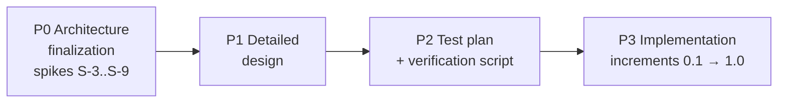

# Implementation plan

- Date: 2026-08-13
- Inputs: [architecture.md](architecture.md), [requirements.md](requirements.md),
  [release-plan.md](release-plan.md), ADR-0006..0010
- Tracking: [TODO.md](../TODO.md)

Four phases. P0 is deliberately risk-first: S-3 can invalidate the entire design, so
nothing else starts until it passes.

## P0 — Architecture finalization (no public release)

Goal: convert every "verify by testing" statement in the docs into evidence.

| Step | Content | Exit criterion |
|---|---|---|
| P0.1 | **Spike S-3** (go/no-go): throwaway script/scratch code — generate a proxy `.lnk` with custom AUMID for (a) plain Win32 exe, (b) exe that sets its own AUMID, (c) packaged app; pin manually; verify never-expand-in-place and identity propagation on **every C-2-supported build family**. Since the P2 test plan does not exist yet, the spike report itself records a **matrix snapshot**: the build families taken from [Microsoft's release-health table](https://learn.microsoft.com/windows/release-health/windows11-release-information) at spike time (later formalized by P2) | Written spike report `docs/spikes/s3-aumid.md` incl. the matrix snapshot; ADR-0006 annotated "verified on builds X/Y" — or the project pivots and this plan is rewritten. **Closed 2026-08-15 with an accepted gate deviation:** GO on family 26200; 26100/28000 reclassified as non-blocking confirmation runs (first entries of the P2 matrix); 22631 descoped (out of support 2026-11-10) |
| P0.2 | Spikes S-4..S-9 (pin flow, pin-edit propagation, elevation, jump lists, `TaskbarManager` pin-request evaluation, UIA test-oracle validation) + `shell:AppsFolder` enumeration check | One report per spike **with an accepted outcome**: pass, or a mitigation folded into the design docs, or an explicit descope/pivot decision recorded. **P1 does not start while any blocking spike is unresolved.** |
| P0.3 | Decide the implementation flavor (architecture §3) from S-3 + S-6 evidence | Decision recorded as a new ADR (per ADR-0001) and architecture §3 updated from "recommended" to "decided" — closed 2026-08-16: **uniform flavor B**, [ADR-0012](adr/0012-uniform-flavor-b.md) |
| P0.4 | Close the blocking decisions: project name, license (TODO) | Repo can go public |

## P1 — Detailed design

Short, code-adjacent documents (each becomes the reference for one module):

| Deliverable | Content |
|---|---|
| `docs/design/config-schema.md` | JSON schema (`schemaVersion` from day one), per-launcher fields (target, **display name**, args, workdir, elevation, window state, icon override, badge, AUMID, proxy path, **lifecycle state**: `awaiting-pin`/`active`/`awaiting-repin`/`pending-removal`/`removing`/`removed` plus the removal-origin and removal-kind fields — architecture §4.3), atomicity/backup rules (NF-12), **migration design** (versioned migrators + their tests — the guarantee active from 0.8, release-plan §2) |
| `docs/design/aumid-scheme.md` | `PinnedLauncher.Proxy.<slug>` generation, slug rules, collision handling, stability across renames |
| `docs/design/cli.md` | `PinnedLauncher.exe` arguments (`--add/--edit/--remove/--open-location/--launch --elevated`, single-instance forwarding), proxy exe contract |
| `docs/design/modules.md` | Class-level design of the Q-6 seams + services (interfaces, ownership, error type), presenter contracts (management-window.md §4), threading model (UI thread + watcher; no background service), logging policy (local, opt-in, NF-9) |

Exit: Q-6 interface headers compile (skeletons, no logic); every module has its design
section; ADR-0013+ recorded for anything that changed along the way.

## P2 — Test plan and verification script

| Deliverable | Content |
|---|---|
| `docs/test-plan.md` | Tiers (`[ut]`/`[qt]`/`[interactive]`, ADR-0009), Windows build matrix (= the in-support Windows 11 **build families** per C-2, each tested on a representative edition, **plus environment-configuration profiles orthogonal to the families** — at minimum the UAC-off / built-in-Administrator profile for the ADR-0011 guard QTs: guard never fires, elevated launch runs promptless, guard resumes when UAC returns), coverage gate definition (line = 100% of core minus named exclusions, branch reported — Q-4; `/PROFILE`, `Microsoft.CodeCoverage.Console`, Cobertura), NF-3 measurement procedure, **test-environment hygiene** (dedicated test profile/VM, reserved test-AUMID namespace, teardown, failed-run recovery — S-9), interactive protocol template, traceability format (declarations from Catch2 tags **joined** with JUnit results, stamped version + commit SHA + candidate-attempt ID + OS build + date; gates accept only version-, commit-SHA-, **and** attempt-matched results — ADR-0009) |
| **Verification script** (`verify`, PowerShell + CMake presets — no CI infrastructure, release-plan §4) | One command: clean configure + build (CMake/MSVC), run UTs (`~[interactive] ~[qt]`), produce coverage report, fail under threshold; `-Release` mode adds the automated `[qt]` shell tier on the local machine; `--artifact <zip>` mode runs the QT tiers **against a packaged candidate** (no build) for matrix machines, reading version/SHA/attempt from the candidate manifest (release-plan §5) |

Exit: empty-but-green verification run; a sample tagged test flows into a generated
traceability stub.

## P3 — Implementation increments (the release train)

Each increment = one alpha release (see [release-plan.md](release-plan.md)).
**Definition of done, every increment:** UTs green, coverage target held, new
requirements' QTs tagged and listed in the traceability matrix, docs updated, release
notes written.

**Cross-cutting Musts** (NF-2 footprint, NF-3 latency, NF-4 non-admin, NF-5 DPI, NF-9
privacy) have no single milestone; enforcement is layered so the claim is verified,
not asserted:
- The verification script carries cheap automated tripwires for the measurable ones,
  **each activating with the component it measures** (against relaxed alpha
  thresholds): the no-network assertion (NF-9) from 0.1.0 on whatever binaries exist;
  proxy launch-latency and exits-immediately asserts (NF-3/NF-2) from 0.3.0; window
  start-time and working-set asserts (NF-3/NF-2) from 0.4.0. NF-2's helper limit has
  nothing to measure pre-1.0 (the helper is post-1.0).
- NF-4 — meaning the app never *requires* elevation to install, configure, or run
  (deliberate elevated *target* launches are user-initiated features, UC-6) — and NF-5
  (PMv2 manifest from the first window) are structural and reviewed at each
  increment's definition of done.
- The full formal QTs land **no later than 0.7**, so the 0.8 gate's
  full-traceability check covers them like every other Must.

| Release | Content | Requirements primarily closed |
|---|---|---|
| **0.1.0** | Repo public. Skeleton: CMake, verification script, Catch2+trompeloeil wired, coverage reporting, **version stamping from Git tag** (release-plan §2.1). Core: config store + domain model (`LauncherTarget` hierarchy) | NF-1/2/12 foundations, Q-1..Q-6 scaffolding |
| **0.2.0** | Icon service: shell icon extraction, badge compositing (corner/size rules), multi-size `.ico` writer; golden-file tests | F-4 |
| **0.3.0** | Shortcut+AUMID manager, windowless proxy exe, launch service, **stable install location** (first-run copy to `%LOCALAPPDATA%`, release-plan §1 — pins must never reference a transient folder); **first end-to-end launcher works**, pinned via the S-8-decided flow (API-first with gesture fallback, pin-flow setting) driven from the **interactive console** — the S-8-validated foreground shape; gesture fallback at 0.3 = printed instructions + the S-4 deep-link, the windowed pin guide arrives in 0.4; **persisted lifecycle states + state-aware reconciliation** (architecture §4.3 — NF-8 core); dogfooding starts | F-1/2/3/5/6, NF-8 (core), UC-1a |
| **0.4.0** | Management window: main list + add/edit + pin guide (presenters, UIA-driven QTs); pending-state re-offer UI (⚠ flows, architecture §4.3) | F-5 (UI), F-8 basics, NF-8 (re-offer UI), UC-1/3/5 |
| **0.5.0** | Jump-list publisher: per-launcher tasks menu, wired to the already-shipping management window CLI | F-9, UC-7 |
| **0.6.0** | Settings page, config import/export, en/it/hu resources, accessibility pass, clean uninstall | F-10, NF-10/11, UC-10/13 |
| **0.7.x** | Should-completion: packaged/document/folder/URL targets, full properties, elevation hardening (incl. the ADR-0011 QTs on the UAC-off / built-in-Administrator profile), **config-migration machinery + UTs** (guarantee active from 0.8, release-plan §2). **Last alpha = feature-complete** | F-7, F-8 full, remaining S-tier |
| **0.8.x** | **Beta / feature freeze** (gate: release-plan §3): bug fixes, polish, user docs, full interactive QT protocol on the matrix | — |
| **0.9.x** | **RC**: bug fixes only; soak | — |
| **1.0.0** | Last RC promoted: same commit re-tagged, rebuilt and stamped 1.0.0 via the verification script (release-plan §2.1) | — |

### Ordering rationale

- 0.2 before 0.3: the shortcut needs the badged icon file to point at.
- 0.3 is the **dogfooding milestone** — from there the developer's own taskbar runs on
  the product, which is the fastest defect detector this project can have.
- The management window (0.4) comes *after* the core pipeline works headless (0.3),
  keeping UI churn away from the risky shell logic — and *before* jump lists (0.5), so
  the `--edit`/`--add`/`--remove` tasks are live from the moment they are published;
  no release ships dead menu commands.
