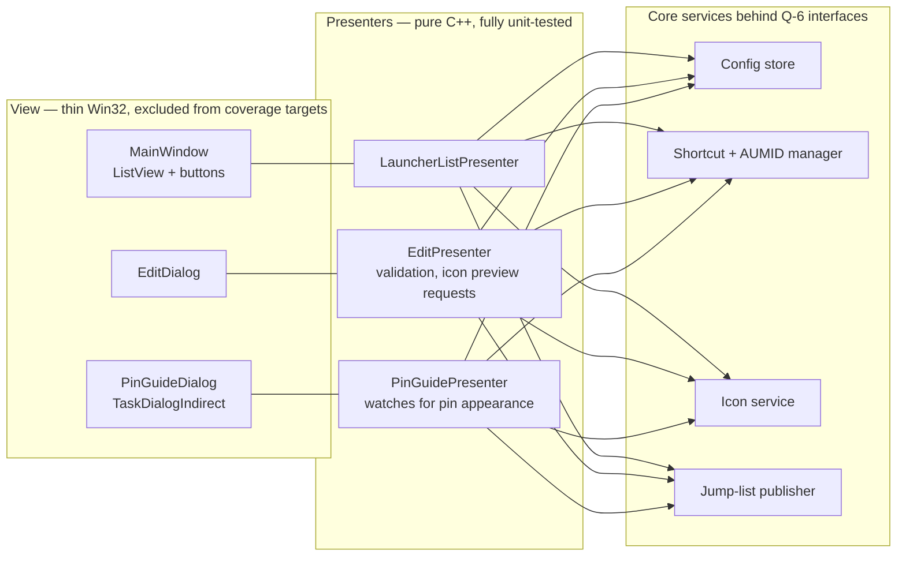

# Management window — design

- Date: 2026-08-13
- Status: designed; technology decision in [ADR-0010](adr/0010-management-window-win32-mvp.md)
- Covers: UC-1, UC-1a, UC-3, UC-5, UC-10, UC-13, UC-14 · F-5, F-8, F-10 ·
  NF-4, NF-5, NF-10, NF-11 · Q-2, Q-3, Q-4, Q-6

## 1. Role and non-goals

The management window is the **only UI the project builds** — everything else on
screen is OS-drawn (pins, jump lists). It exists solely to *configure* launchers; it
is **never part of the launch path** (pins launch targets directly or via the
windowless proxy, with no window involved).

Non-goals: it is not a launcher itself (no "launch" button as a primary affordance),
not a dock, not a background service, and it never draws on or near the taskbar.

## 2. Lifecycle and entry points

| Entry point | Behavior |
|---|---|
| Start menu entry / `PinnedLauncher.exe` (no args) | Opens the main view |
| Jump-list task `--edit <slug>` | Opens directly on that launcher's edit dialog |
| Jump-list task `--add` | Opens directly on the add flow |
| Jump-list task `--remove <slug>` | Opens the remove confirmation for that launcher |

- **Single instance**: named per-user mutex; a second start forwards its command line
  to the running instance (`WM_COPYDATA`) and exits, so jump-list tasks always land in
  one window.
- **No background presence**: the process exits when the window closes. The optional
  tray icon ("quick access to settings") is deferred to **post-1.0** (TODO.md).
- **Reconciliation / health check at every start** (architecture §4, NF-8): regenerate
  missing or stale derived artifacts from config, flag orphans and known-regression
  conditions, surface pending-removal launchers.
- Closing the window never affects the pins — they are OS-persisted shortcuts.

## 3. UI technology

Decision recorded in [ADR-0010](adr/0010-management-window-win32-mvp.md); summary:

| Option | Verdict |
|---|---|
| **Plain Win32 window + common controls** (ListView, TaskDialog, standard dialogs) | ✅ **chosen** — the functional surface is a list plus a handful of dialogs; native controls give UI Automation, keyboard navigation, IME, and high-contrast support for free (NF-10) |
| Custom-drawn (Direct2D) window | ❌ overdesign for a settings window (Q-3): hand-rolled list virtualization, text editing, and a from-scratch UIA provider — all to restyle a config dialog |
| WinUI 3 (C++/WinRT) | ❌ the C-1 gate ("only if plain Windows APIs are insufficient") is **not met**: nothing here exceeds common controls. Would add the Windows App SDK runtime + packaging pressure for cosmetics |

**Theming honesty:** Windows still offers no *documented* dark-mode theming for Win32
common controls. Policy: documented APIs only —
`DwmSetWindowAttribute(DWMWA_USE_IMMERSIVE_DARK_MODE)` for the title bar and
documented per-control colors (`LVM_SETBKCOLOR`, custom-draw) where they suffice; **no
undocumented uxtheme ordinals** (same no-fragile-internals principle as ADR-0003). If
the system theme is dark, MVP ships a dark title bar and a correct, if light-ish,
client area; a fuller dark client via documented coloring is a *Could* (F-10 scope).

## 4. Structure (Q-2 / Q-6): thin view, testable presenter

Model–View–Presenter, sized to the problem (three presenters, no framework):



- Presenters contain every decision (validation, orchestration of the
  compose-icon → write-shortcut → commit-jump-list → commit-config pipeline
  (architecture §4), name-collision handling, pin detection) and speak only to the
  Q-6 interfaces → they run headless in UTs with fakes/trompeloeil, meeting the Q-4
  coverage target.
- Views translate messages to presenter calls and render presenter state; they contain
  no logic and sit in the named coverage exclusions (Q-4).
- Inheritance where natural (Q-2): a small `Window` base (RAII HWND, message-map
  virtuals) with `MainWindow`/`EditDialog` derived; presenters share no base — no
  artificial hierarchy (Q-3).

## 5. Views and flows

### 5.1 Main view

```text
┌─ Launcher ──────────────────────────────────────────────────┐
│  ┌────────────────────────────────────────────┐  [ Add… ]   │
│  │ 🗒️ᴸ  Notepad      C:\Windows\notepad.exe  📌 │  [ Edit… ]  │
│  │ 💻ᴸ  VS Code      %LOCALAPPDATA%\...\Code  📌 │  [ Remove ] │
│  │ 🧮ᴸ  Calculator   (packaged app)           ⚠ │             │
│  └────────────────────────────────────────────┘             │
│  ⚠ = generated but not pinned yet (click to open pin guide) │
│  [ Settings… ]                              [ Close ]       │
└──────────────────────────────────────────────────────────────┘
```

- ListView (details mode) with the **badged** icon, name, target, and pin status.
- Pin status is a **best-effort heuristic** (presence of the pinned `.lnk` copy under
  `User Pinned\TaskBar`) — displayed as informational, never blocking (the shell owns
  the truth; spike S-4 refines detection). The ⚠ state covers both *not pinned yet*
  and *edited, awaiting re-pin* (§5.2); clicking it opens the pin guide.
- Launchers in `pending-removal`/`removing` state (architecture §4) stay listed,
  dimmed, with explicit **Resume removal** / **Cancel removal** actions — the states
  are persisted in config, so they survive restarts and crashes mid-removal. Terminal
  `removed` tombstones (full uninstall, UC-13) do **not** appear here; they surface
  only in the uninstall summary, so "the list is empty" and "tombstones are retained"
  are simultaneously true.
- Drag-and-drop of `.exe`/`.lnk`/documents onto the window starts the add flow (UC-1).
- Reordering launchers is deliberately **absent**: order on the taskbar is native drag
  of the pins themselves (UC-4); the list here sorts by name.

### 5.2 Add / Edit launcher (UC-1, UC-5)

One dialog, two modes. Fields: target (browse / installed-apps picker / prefilled by
drag-drop), display name (prefilled from target), icon (auto from target; *Change…* /
*Reset*), badge toggle, and an *Advanced* expander: arguments, working directory, run
as administrator, window state. Live preview of the final badged icon at 16/24/32 px.

Property applicability depends on the target kind — the dialog shows only what
applies, and validation enforces the matrix (hidden ≠ silently ignored). A `.lnk`
target is classified by its **resolved destination** (a shortcut to a folder gets
folder capabilities, to a document document capabilities, and so on) — never treated
as executable-like merely for being a shortcut:

| Property | exe (incl. `.lnk`→exe) | packaged app | document | folder | URL |
|---|---|---|---|---|---|
| Arguments | ✅ | ⚠ activation args only | ❌ | ❌ | ❌ |
| Working directory | ✅ | ❌ | ❌ | ❌ | ❌ |
| Run as administrator | ✅ | ❌ | ❌ | ❌ | ❌ |
| Window state | ✅ | ❌ | ⚠ best-effort | ⚠ best-effort | ❌ |
| Open target's folder (UC-7) | ✅ | ❌ | ✅ | ✅ (itself) | ❌ |
| Focus-or-launch (UC-6, Could) | ✅ | ⚠ | ❌ | ❌ | ❌ |

OK triggers the presenter pipeline (**icon → shortcut → jump list → config commit**,
with reverse-order rollback on mid-pipeline failure and reconciliation at next start —
architecture §4) and chains into the pin guide (§5.3) in two cases: a **new launcher**
(initial pin), or an **edit that changes what the pin shows** (name/icon — a re-pin is
the guaranteed update path, architecture §4.2). For such an edit, the config commit
itself **atomically writes state `awaiting-repin`** — before the guide opens, not when
the user defers — so a crash between commit and guide still leaves a state that
reconciliation re-offers; the state returns to `active` only when the guide's
two-phase watcher (§5.3) observes the completed re-pin.

### 5.3 Pin guide (UC-1a)

`TaskDialogIndirect` with numbered instructions ("Open Start → All apps → right-click
*'{name}'* → Pin to taskbar"), a button that opens the Start menu on the entry where
possible, and a *"pin detected"* confirmation when the watcher (the same best-effort
heuristic as §5.1 — presented as a detection, never as certainty) sees the pinned copy
appear. In **edit mode** (re-pin, §5.2) the guide is a two-phase state machine with
explicit unpin instructions first: watch for the old pinned copy's **disappearance**,
then for the new pin's **reappearance** — the mere presence of the pre-existing pin
never satisfies it (an icon-only edit would otherwise "succeed" instantly without the
pin changing). Skippable; re-openable from the ⚠ status. This dialog and
the QT harness prompt (ADR-0009) share the same helper — one implementation, two uses.

### 5.4 Settings (UC-10)

Deliberately short, matching the requirement that Windows owns look & feel: default
launch behavior (plain launch vs the optional focus-or-launch, per-launcher
overridable — UC-10), default badge on/off + corner, config location + *Open* /
*Export…* / *Import…* (import shows a **preview** of targets/arguments/elevation —
including, in replace mode, the launchers that will be *removed* via the standard UC-3
flow — and a replace-or-merge choice before applying; UC-8), language (NF-11), and
***Remove all launchers…*** — the uninstall entry point (UC-13). No theme settings —
the window follows the system. No AUMID scheme setting — it is fixed by design
(UC-10). No tray/autostart settings — the optional tray helper is post-1.0
([TODO](../TODO.md)).

## 6. Platform conformance

- **DPI**: Per-Monitor v2 manifest; ListView icon sizes re-requested on
  `WM_DPICHANGED` (NF-5).
- **Accessibility**: native controls expose UIA automatically; access keys on every
  button; full tab order; dialog-standard Esc/Enter behavior (NF-10, UC-14).
- **Localization**: all strings in resource string tables, at least en + it + hu
  (NF-11).
- **No elevation**: runs as the user, always (NF-4); the only elevated thing it ever
  triggers is a target launch via the documented `runas` verb on user request.

## 7. Testing (per ADR-0008/0009)

- **UT**: presenters fully covered with fakes/trompeloeil (validation, pipelines,
  collision and error paths, pin-watch state machine).
- **QT — fully automated, no gestures needed**: the window itself is driven end-to-end
  via UI Automation (`[qt]` tier): launch with `--add`, fill the dialog through UIA
  patterns, assert the proxy `.lnk`/icon/jump-list artifacts on disk. The only
  gesture-gated QTs remain the pin-related ones (ADR-0009).

## 8. Open questions

1. Installed-apps picker source: enumerate `shell:AppsFolder` (covers Win32 + packaged
   uniformly) — spike-verify item ordering/perf with large app lists.
2. Can the pin guide deep-link Start to the entry (`shell:AppsFolder` selection) or
   only open the folder? Cosmetic; resolve during S-4.
